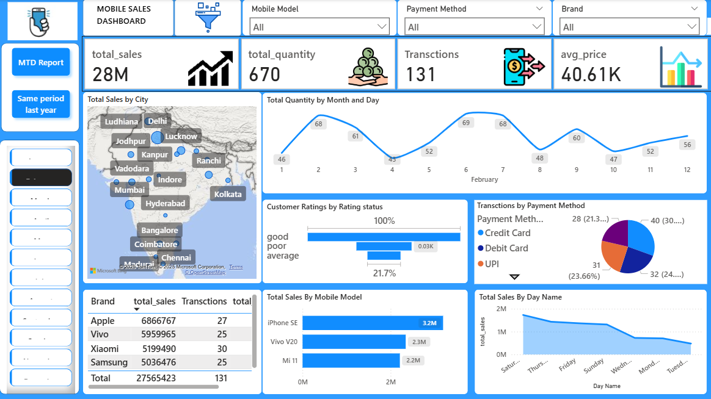

# 📱 Mobile Sales Data Report

This project processes and visualizes **mobile retail sales data** to uncover insights into customer preferences, popular brands, and pricing trends. The goal was to transform raw data into meaningful insights using **Excel** dashboards and reports.

---

## 🎯 Objective

To analyze mobile sales data and identify key patterns in customer behavior, top-selling brands, and the relationship between price and demand.

---

## 🧩 Tools & Technologies

- **Excel** – Data cleaning, transformation, and visualization  
- **Pivot Tables & Charts** – Trend and comparison analysis  
- **Conditional Formatting** – Highlighting KPIs and anomalies  
- **Formulas & Functions** – SUMIFS, COUNTIFS, and VLOOKUP for aggregation  

---

## 📂 Project Structure
```
mobile-sales-data-report/
│
├── data/
│ ├── mobile_sales_raw.xlsx
│ └── mobile_sales_cleaned.xlsx
│
├── reports/
│ └── Mobile_Sales_Report.pdf
│
├── dashboard/
│ └── Mobile_Sales_Dashboard.xlsx
│
├── images/
│ └── mobile_dashboard_preview.png
│
└── README.md
```


---

## 🔍 Steps Performed

1. **Data Cleaning** – Removed duplicates and standardized columns like brand, price, and rating.  
2. **Data Analysis** – Used Excel formulas and pivot tables to summarize key metrics.  
3. **Visualization** – Created charts for:
   - Brand-wise and model-wise sales  
   - Price vs. quantity sold  
   - Top-performing regions and months  
4. **Insights Reporting** – Compiled findings into a formatted Excel and PDF report.

---

## 📈 Dashboard Preview



---

## 💡 Key Insights

- **Mid-range phones (₹10k–₹20k)** had the highest demand.  
- **Brand loyalty** influenced repeat purchases in certain regions.  
- **Online sales channels** outperformed retail outlets during festive months.  
- Demand was strongly correlated with **discount periods** and **launch events**.

---

## 🚀 Results & Impact

This project helped demonstrate how structured Excel analysis can support:
- Inventory and pricing decisions  
- Brand performance tracking  
- Customer trend forecasting  

---

## 🧠 Learning Outcome

- Strengthened Excel skills for **data cleaning, aggregation, and visualization**  
- Improved ability to turn sales data into actionable business insights  
- Enhanced understanding of consumer behavior in retail analytics  

---

## 🔗 Repository & Resources

- 📂 GitHub: [https://github.com/swati-insights/mobile-sales-data-report](https://github.com/swati-insights/mobile-sales-data-report)  
- 📧 Contact: [shaluswati109@gmail.com](mailto:shaluswati109@gmail.com)

---

